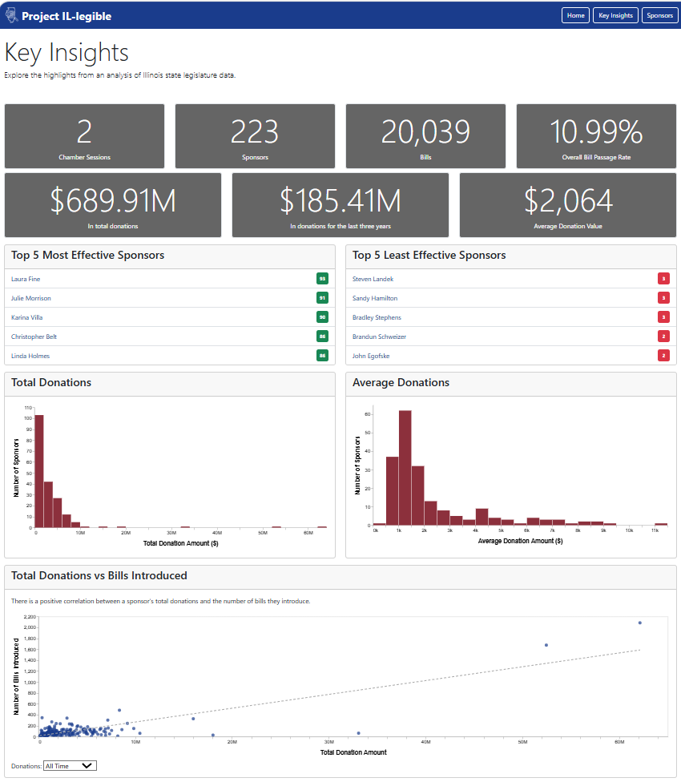

# Project IL-legible
See the website in action at https://www.project-il-legible.com/

## About
Project IL-legible attempts to analyze and understand the intersection of bill sponsorship and financial contributions to legislatures of the Illinois State General Assembly. We pull and join data from different data sources to accomplish this, in addition to reporting on the more interesting findings that we've been able to uncover. Our primary goal is to make Illinois legislation data more accessible and readable for a wider audience.

Team Members: 
- Brock Sauvage <bsauvage@uchicago.edu>
- Elie Nowlis <enowlis@uchicago.edu>
- Max Manalang <manalang@uchicago.edu>
- Luke Friedman <lukef@uchicago.edu>

Data Sources:
- Open States (https://open.pluralpolicy.com/data/)
- Illinois Sunshine (https://illinoissunshine.org/)

A screenshot of a page on the website and a quick video walk-through are included below.



Project video: [a link to your project video] TO DO

## Instructions
### Adding Bulk Data

You will first need to manually add bulk data from Open States. Go to https://open.pluralpolicy.com/data/, find the relevant data set for the IL session you're looking for, download, and unpack it. The result should be a set of .csv files under a directory structure that looks like `IL/[# session]`. At this point, you may merge these files with the `data_pull_and_clean\pull_open_states\bulk_data` directory in the repo - just make sure the directory structure is maintained, since the `get_bulk_data.py` "data get" methods rely on this.

### Create Data Used in Website

After downloading the bulk data, you want to populate the final_data folder, which is
what is used for the website databases. To do so, run `bash create_datasets.sh` from the command line.

### Web Framework

For this project, we'll be using the Flask web framework. This tool allows us to keep and maintain and lightweight database, spin up a web server, serve HTML/CSS files to a browser, and more. Read more about it [here](https://flask.palletsprojects.com/en/stable/#user-s-guide).

There are a few steps to take to get the app up and running on your machine. Once completed, you'll be able to work with the project.

### Initializing the Database

Since we don't check the database into version control, you'll need to intiialize (create) and seed the database - populating it with all of the relevant data we'll be using in our app. To initialize, run this from the command line in the root directory of the project:

`uv run flask db init`
`uv run flask db upgrade`

Once this has ran, you should see a `app.db` file in the `instance` folder of the project.

### Seeding the Database

To get data in your database, first ensure you have the bulk data files for Open States in the correct directories, and then run:

`bash create_datasets.sh` (or whatever command you use to execute a shell script)

This process should take a few minutes, and it will create `final_data/bills.csv` and `final_data.sponsors.csv`. Once you have these, you are ready to seed the database. Make sure you have intiialized the DB using the command above, and then run:

`uv run flask dbc seed`

The database should now have data. If you find yourself needing to reseed the database, you can drop and recreate the tables before rerunning the seed command:

`uv run flask dbc drop-tables`
`uv run flask dbc create-tables`

### Exploring the Database

During development, it will be necessary to explore the data and test out queries before running them in the server-side handlers. An easy way to do that is as follows:

`uv run flask shell`

The above command will start a Python shell with a create app context - which allows you to access the app object and database as if it were running live. Now, you can run queries on the models like this:

```
>>> query = sa.select(Sponsor)
>>> db.session.scalars(query).first()
```

Please refer to SQLAlchemy documentation for specific methods and syntax for querying tables within the database.

### Running the Web App

After the database has been created and seeded with data, we can finally spin up the web server to run our app:

`uv run flask run --debug`

## Environment Variables [DO WE STILL NEED THIS?]

This project makes use of several APIs that require API keys for endpoint requests. Many of these will require API keys which are not to be checked into version control for security reasons. Instead, we will be using an envrionment file - a file that keeps track of the API keys, sensitive info, and specific configuration settings for your local program. Following these steps, you may set up your own environment file with custom variables defined:

1. Run `touch .env` in the same directory as your `uv.lock` 
2. Run `echo UV_ENV_FILE=.env` to tell where UV where to look for the environment file.
3. Populate the .env file with key-value pairs delimited with an equal sign, e.g. `MY_KEY="123"`

Please ensure that the `.env` file is included in the `.gitignore` and that it IS NOT checked into version control.

## Data Exploration [DELETE THIS]

The APIs for Open States and Illinois Sunshine have some significant rate limit barriers in place that would make the aggregate analysis of things like bills and sponsors VERY slow and painstaking. Instead, we are leveraging bulk data (CSVs) to accomplish this analysis. An `exploration` module has been created that will pull data from the `bulk_data` directory into Pandas data frames. You may add additional functions to this module if you have the need to explore different datasets. To actually interact with these functions, you can edit the `Exploration.ipynb` file in the root directory, or create your own (please exclude from version control).

### Setting up Jupyter in VS Code [DELETE THIS]

1. Run `uv sync` in the root directory to ensure that the ipykernel package is installed.
2. Install the Jupyter VS Code extension (this will let you work with notebooks natively in VS Code)
3. If you change `explore.py`, you'll need to restart the Jupyter kernel by clicking the "Restart" button in the VS Code interface.
4. As usual, any packages you'd like to import into the Jupyter notebook will need to be added to the virutal environment with `uv add`.


